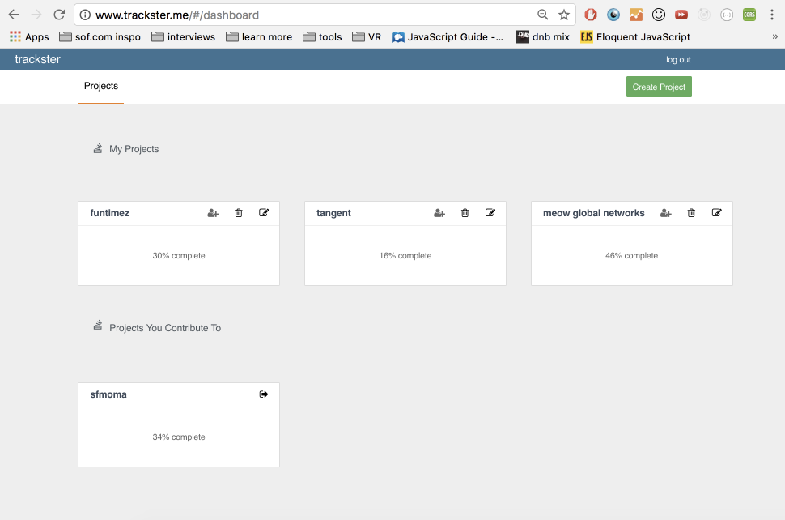
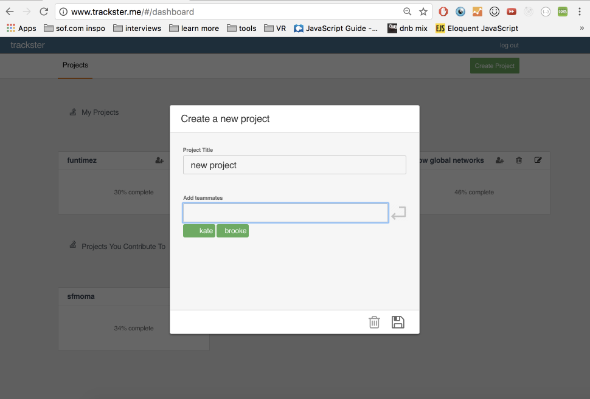
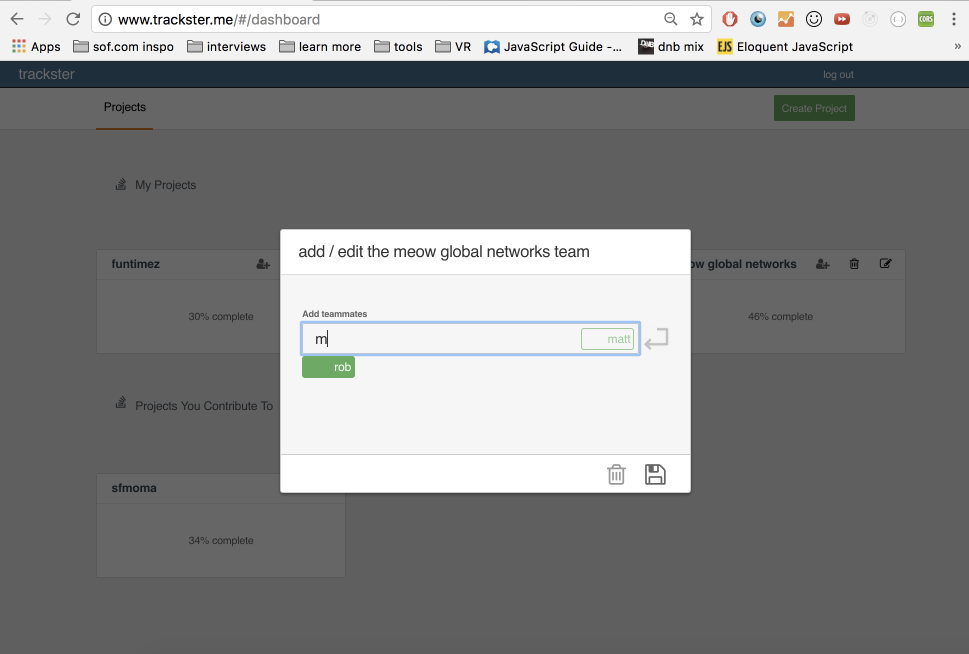
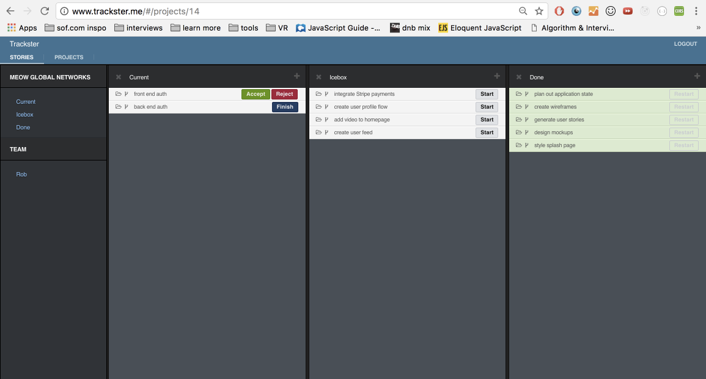
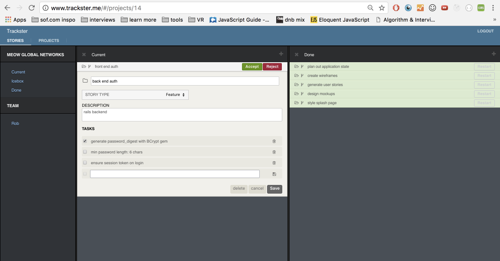

# __TRACKSTER.__
:shipit::shipit::shipit::shipit::shipit::shipit::shipit::shipit::shipit::shipit:

[Trackster live](http://www.trackster.me)

Trackster is a full-stack web application inspired by Pivotal Tracker. It utilizes Ruby on Rails on the backend, a PostgreSQL database, and React.js with a Redux architectural framework on the frontend. It was planned and executed within a two week time frame.

## __Features & Implementation__

### __Project Dashboard__   
On the database side, the projects are stored in one table, which contains columns for `id`, `title`, and `creator_id` which references the user who created the project. An invites join table holds the association between projects and `members` - users who are added to the project by the creator. Upon login, an API call is made to the database which joins the users table and the projects table on `user_id` and filters by the current user's `id`. These projects are held in the `Projects` store until the user's session is destroyed.

`ProjectIndexItem` components are filtered into 'My Projects' and 'Projects I Contribute To' by selectors called from the `ProjectIndex` component.

A closer look at the `ProjectIndex` component:

```
import React from 'react';
import ProjectIndexItemContainer from './project_index_item_container';
import { myProjects, teamProjects } from '../../reducers/selectors';

class ProjectIndex extends React.Component {
  constructor(props) {
    super(props);
    this.getVisibleProjects = this.getVisibleProjects.bind(this);
  }

  componentWillMount() {
    this.props.fetchAllProjects();
  }

  getVisibleProjects(projects, filter) {
    switch(filter) {
      case 'my-projects':
        return myProjects(projects, this.props.currentUser.id);
      case 'team-projects':
        return teamProjects(projects, this.props.currentUser.id);
    }
  }

  render() {
    const visibleProjects = this.getVisibleProjects(
      this.props.projects,
      this.props.filter
    );

    return(
      <div className="projects-index-container">
        <ul>
          {
            visibleProjects.map((project, idx) => (
              <ProjectIndexItemContainer
                key={idx}
                project={project} />
            ))
          }
        </ul>
      </div>
    );
  }

}

export default ProjectIndex;

```

The `ProjectIndex` component is rendered within the `Dashboard` component which also holds the ability to create and destroy `projects` and `invites`. The UI of the `Dashboard` is designed to be similar to Pivotal Tracker's for a professional, clean look:



The field to add project members has autocomplete enabled for easy adding of existing users.



### __Project Stories__
Projects have many stories - these are the actionable items for the project. Implementing Stories began with a stories table in the database. The `stories` table contains the following columns:
* `title`
* `internal_state` - a string to track whether a story is `unstarted`, `started`, `finished`, `delivered`, `accepted`, `rejected`, `restarted`, or `done`. The story will be displayed differently depending on its internal state.
* `story_type` - a tag to indicate if a story is a `feature`, `chore`, `bug`, or `release`. This story type is displayed on the story show view for the user's reference.
* `description`
* `priority` - an integer that determines the order in which stories are displayed.
* `ice_boxed` - a boolean value to indicate whether a story should appear in the project's ice box or not. All stories are ice boxed on creation.
* `project_id` and `user_id` - indexed references to identify the project it belongs to, and the user who created it.

Stories are filtered into 'Current', 'Icebox', and 'Done' `StoryPanel` components and rendered by the `Project` component like this:



The left side of the above Project component is the `StoryNav` component. The 'Current', 'Icebox' and 'Done' links toggle each panel, so the user can choose which categories to view at any time. Stories that are newly created, and have the default `internal_state` of 'unstarted' are displayed in the Icebox. Once a user clicks 'start', the story is moved out of the Icebox and into current, and its `internal_state` is updated to 'started'. Story internal states are stored in a `stateTransform` lookup table, so they are easily accessible. The story remains in Current until it is 'accepted'. At that point it is moved to the Done panel. Stories can be added, deleted, and updated at any time.

A story can also be dragged and dropped to re-order Stories within their respective `StoryPanel` components. To achieve this, each `StoryPanel` is a React DnD `DragDropContext`. Each story is wrapped in a `StoryPanelSpot` which monitors the hover action of the dragged Story, and returns a `DropTarget`. `Story` components are the `DragSource` components. Dragging and dropping a story updates its own priority, and the priority of all stories with a priority lower than the updated value. This allows users to visually prioritize what needs to be done.

### __Tasks__
Each story can have many tasks. These are stored in the `tasks` database table with a `story_id`, `body`, and a `complete` boolean field. Tasks are rendered in a `Task` component and can be edited, and marked as complete from within the `Story` component. New tasks can be added with help from the `TaskForm` component.



## __Future Directions for the Project__
In addition to the features already implemented, I plan to continue work on this project. The next steps for Trackster are outlined below.

__Velocity__  
Tracking a project's velocity is a standard feature of Pivotal Tracker. I plan to implement a point based system for Stories, and allow users to decide the number of points they can accomplish each sprint. The team's success or shortcomings will be reflected by their velocity.  

__Story Explosions!!__  
Having a story 'accepted' and being marked as 'done' is nice, but it will be even better once I incorporate some animation magic to explode accepted stories using CSS or Canvas if necessary. 
